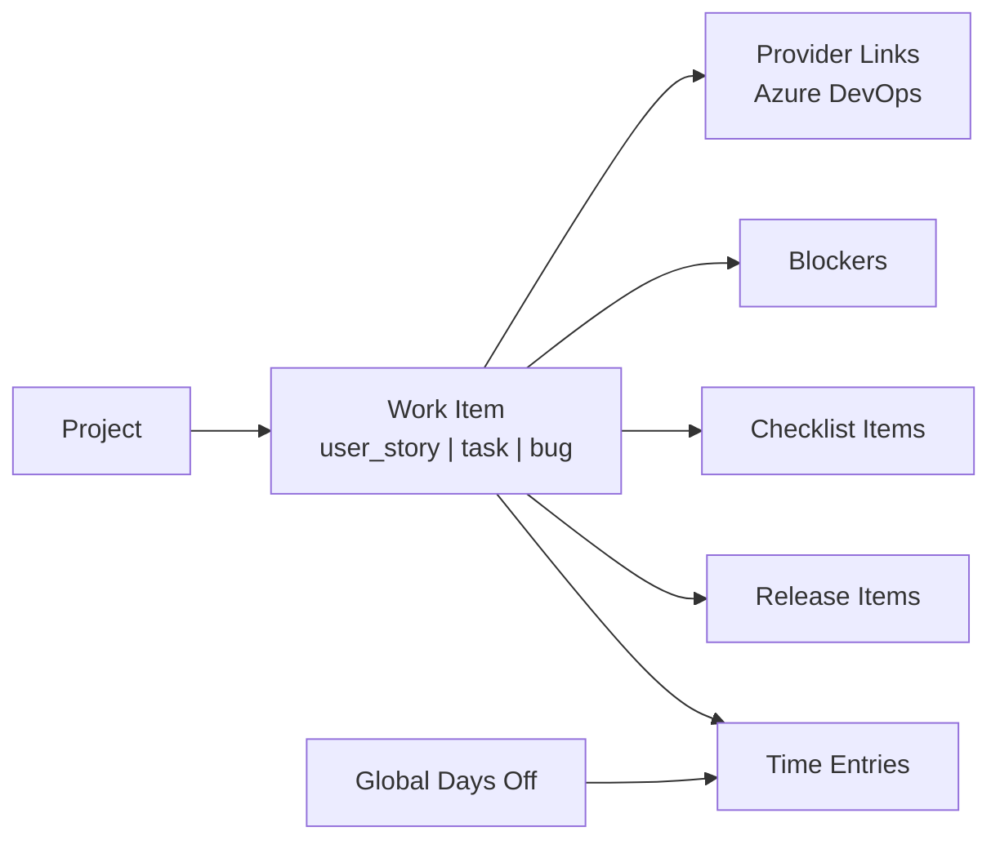

# Domain Model

## Overview

Project Manager uses its own domain model for work planning and time tracking. External systems such as Azure DevOps are optional integrations, not the source of truth for core Project Manager behavior.

The SQLite database is created as `project_manager.db`. This database name intentionally differs from the legacy `time_tracker.db` name so a clean installation does not collide with older local data.

## Work Items

`work_items` is the canonical table for planned and tracked work. Every work item has a Project Manager type and normalized Project Manager status.

Supported types:

- `user_story`: release planning item. User stories do not appear in time tracking.
- `task`: trackable work item. Tasks can appear in time tracking and can be attached to a parent user story.
- `bug`: trackable work item. Bugs can appear in time tracking and can be attached to a parent user story.

Core fields:

- Title and Markdown description.
- Project Manager type and normalized status.
- Optional assigned Project Manager user.
- Optional parent work item for child tasks and bugs.
- Optional display order for user-specific time tracking order.
- Audit fields for creation and update ownership.
- Sync state for provider diagnostics.

## Statuses

Project Manager stores normalized statuses:

- `new`
- `in_progress`
- `resolved`
- `completed`

The UI may display provider-friendly labels such as New, Active, Resolved, or Closed. Provider-specific statuses are mapped to the normalized set and preserved separately on provider links for diagnostics.

Default status flows:

- `task`: `new` -> `in_progress` -> `completed`
- `bug`: `new` -> `in_progress` -> `resolved` -> `completed`
- `user_story`: `new` -> `in_progress` -> `resolved` -> `completed`

## Workflow Gates

Project Manager validates local status changes before saving them.

Hardcoded gates:

- A task cannot enter `completed` while it has incomplete checklist items.
- A task cannot enter `completed` while it has active blockers.
- A bug cannot enter `resolved` while it has incomplete checklist items.
- A bug cannot enter `resolved` while it has active blockers.
- A user story cannot enter `resolved` while it has incomplete checklist items.
- A user story cannot enter `resolved` while it has active blockers.

When a local status change passes the gate but provider synchronization fails, the local change remains saved. The affected work item and provider link are marked as `sync_failed` so the UI can surface the failed sync without blocking local work.

## Provider Links

External provider identity is stored outside the core work item record.

`work_item_external_links` stores:

- Provider name.
- External work item id and URL.
- Provider-native type and status.
- Provider-native assignee snapshot.
- Sync enabled state and sync status.
- Last sync error.

This keeps Project Manager work items provider-neutral while still preserving enough provider metadata for refresh, status sync, diagnostics, and assignment display.

## Provider User Identity

Provider credentials are personal user credentials. When a user saves an Azure DevOps PAT, Project Manager resolves the provider identity for that token and stores it in `provider_user_identities`.

Provider identity mappings are used to assign imported provider child tasks and bugs to Project Manager users when the provider assignee can be matched. If no mapping exists, the imported child item remains unassigned locally and keeps the provider assignee snapshot for display.

## Days Off

Days off are global per user. They are not project records and remain available even when the user has no accessible project.

The Calendar page stays reachable without an active project. Time Management and Release Planning remain visible, but show a project-required empty state when no active project can be resolved.

## Project Context

Project-scoped pages and APIs require an active accessible project. Explicit requests for an unavailable project fail with a clear `403` or `404` instead of silently falling back.

Fallback to a default or first accessible project is used only when the UI has stale active-project state, such as a cookie from a previous Host identity.
