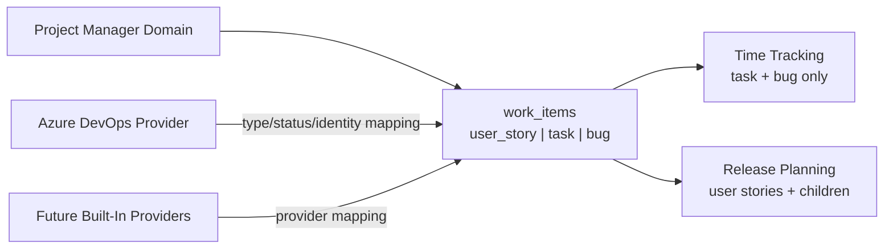

# Domain Model Refactor

## Description

Project Manager needs a clearer domain model that separates project release planning from personal time tracking. The current implementation grew in layers and mixes project-scoped work, user-owned time tracking rows, Azure DevOps snapshots, release planning items, checklists, blockers, and global user calendars in ways that no longer match the intended product behavior.

The refactor should use Project Manager's own work item classification instead of binding core behavior directly to Azure DevOps names. Azure DevOps is the first external task-management provider, but the model should allow future built-in providers without introducing a plugin system.

Core decisions:

- Days off are global per user, shared across projects, and available even when the user has no accessible project.
- Calendar is always reachable for authenticated users, regardless of project availability.
- Time Management and Planning require an active project. If no project is selected, the pages stay reachable but show a clear project-required empty state.
- Non-admin project members can create child tasks for project members.
- Project Manager work item types are owned by Project Manager, not by Azure DevOps.
- Initial Project Manager work item types are `user_story`, `task`, and `bug`.
- `task` and `bug` can appear in time tracking.
- `user_story` does not appear in time tracking.
- Blockers are supported on all work item types.
- Checklists are per user and attach to a work item. In the current UI scope, checklist actions are exposed only for `task`.
- Release planning primarily works with `user_story` items and child `task` or `bug` items.
- Child `task` and `bug` records should point to their parent `user_story` through an internal key such as `parent_work_item_id`.
- External provider work item types should be mapped into Project Manager work item types through provider-specific mapping code.
- A project can have no external integration. If an integration is configured, it is selected from a supported provider list such as `azure_devops`.
- Project integration is a project-level setting; provider credentials are per user.
- Work item creation is local-first. If a provider is configured, the user can optionally create or sync the local item to the provider.
- The refactor can rebuild the database from a clean schema. Backward-compatible migrations and schema-version compatibility are not required for this project reset.

Proposed normalized status set:

- `new`
- `in_progress`
- `resolved`
- `completed`

Provider mapping should translate external statuses into this normalized set and preserve provider-native status for display and diagnostics. `resolved` is the normalized intermediate state for cases where implementation work is done but the item still needs validation, especially for bugs that need QA before `completed`. Tasks can skip `resolved` and move directly to `completed`.

## Milestones

### Phase 1 - Confirm domain boundaries

**Status**: Not Started

Define the domain rules before changing persistence.

Tasks:

- Document Project Manager work item types and allowed behaviors.
- Confirm that days off are global user calendar entries and not project records.
- Define no-project behavior for each page.
- Confirm that non-admin project members can create child tasks for project members.
- Keep bugs time-trackable.
- Keep blockers available for `user_story`, `task`, and `bug`.
- Define the normalized Project Manager status set.
- Define type-specific transition expectations:
  - `task`: `new` -> `in_progress` -> `completed`
  - `bug`: `new` -> `in_progress` -> `resolved` -> `completed`
  - `user_story`: `new` -> `in_progress` -> `resolved` -> `completed`
- Define status transition rules once and reuse them across time tracking, release planning, and provider sync.

Recommendation:

- Use `resolved` as the Project Manager intermediate validation state. It is familiar from Azure DevOps and similar systems, while still preserving `completed` as the final closed state.

### Phase 2 - Redesign persistence

**Status**: Not Started

Replace layered tables with a clean schema that encodes current business behavior directly.

Tasks:

- Replace `tasks` and `release_work_items` with a canonical `work_items` table.
- Use generated internal identifiers for work items so records do not depend on external provider ids.
- Store Project Manager type on `work_items` as `user_story`, `task`, or `bug`.
- Store normalized Project Manager status on `work_items`.
- Store optional Project Manager assignee on `work_items`, for example `assigned_user_id`.
- Store optional `parent_work_item_id` on `work_items` for child tasks and bugs attached to a user story.
- Store provider identity separately from core domain fields.
- Add a provider link table such as `work_item_external_links`.
- Use uniqueness constraints for external links, for example project plus provider plus external id.
- Store provider-native status, provider-native type, and provider URL/reference on the external link.
- Store provider-native assignee snapshot on the external link or provider snapshot so unmapped external assignees remain visible.
- Store provider user identity mappings per Project Manager user and provider, for example Azure DevOps email or unique identity id resolved from that user's PAT.
- Store only mapped provider fields plus a bounded sanitized snapshot or hash for diagnostics and change detection. Do not store full unfiltered provider payloads by default.
- Use release join records for release-specific order, notes, and status context.
- Store time entries against `work_item_id`, `user_id`, and `date`.
- Store checklists against `work_item_id` and `user_id`.
- Store blockers against `work_item_id`.
- Add audit fields to work items, blockers, and checklists: `created_by_user_id`, `created_at`, `updated_by_user_id`, and `updated_at`.
- Add blocker resolution fields: `resolved_at`, `resolved_by_user_id`, and `resolution_comment`.
- Make day offs global with uniqueness on `user_id` and `date`.
- Remove project columns from day offs.
- Remove redundant project and user columns from child tables when they can be derived from the referenced work item.

Recommendation:

- Prefer normalized core tables plus provider mapping tables over Azure-specific columns on every domain entity.

### Phase 3 - Refactor project context and page behavior

**Status**: Not Started

Make page and API behavior explicit when no project exists or the requested project is unavailable.

Tasks:

- Change explicit project requests to fail with `403` or `404` instead of silently falling back.
- Keep fallback behavior only for stale UI cookies and clear invalid active project state in the UI.
- Keep Calendar reachable without a project.
- Keep Settings reachable without a project so administrators can create the first project.
- Keep Time Management and Planning visible in navigation.
- Show a project-required empty state when Time Management or Planning opens without an active project.
- Show profile sections that are global without a project.
- Hide or disable project-scoped profile settings until a project exists.
- Ensure project-scoped APIs return a clear `400` when no active project is available.

Recommendation:

- Separate global routes from project-scoped routes at helper level so each API explicitly declares whether it needs a project.

### Phase 4 - Split release planning from time tracking

**Status**: Not Started

Separate planning user stories from trackable tasks and bugs.

Tasks:

- Update Time Management queries to load only `task` and `bug`.
- Keep user stories out of time entry editing and time export.
- Update Planning imports to create or link `user_story` records.
- Keep child tasks and bugs as separate work items linked to a parent user story.
- On user story import, always fetch provider child tasks and bugs and upsert them into Project Manager.
- On Planning refresh, always refresh the user story and check for newly added provider child tasks and bugs.
- Map provider assignees to Project Manager users through stored provider identity mappings.
- If a provider assignee maps to a Project Manager user, assign the imported task or bug to that user.
- If a provider assignee does not map to a Project Manager user, keep the local item unassigned and preserve the provider assignee snapshot for display.
- Allow automatically imported and mapped child tasks and bugs to appear in assigned users' time trackers.
- Keep unmapped externally assigned child tasks and bugs out of personal time trackers until they are assigned to a Project Manager user.
- Put newly imported child tasks and bugs at the bottom of the user's time tracker order by default.
- Consider future time tracker filters for release, tracked-time presence, status, or planned work if automatic imports make the list noisy.
- Add a project-member endpoint usable by non-admin project members.
- Replace `/api/users` usage in Planning with the project-member endpoint.
- Allow child task creation for any project member, including admins and non-admins.
- Keep task and bug counts visible in Planning.
- Hide checklist actions outside the supported current UI scope.
- Keep checklist generation available only for the supported current checklist scope.

Recommendation:

- Use explicit parent-child keys instead of title prefixes. Prefixes such as `BE:` and `FE:` can remain presentation labels, not relationship identifiers.

### Phase 5 - Project setup and provider configuration

**Status**: Not Started

Make external integrations optional and provider-shaped.

Tasks:

- Redesign project creation so only name is required.
- Add optional project description.
- Do not show admin users in explicit project member assignment; admins automatically have project access.
- Query Docker Host for users assigned to the module, then allow project assignment for non-admin assigned users.
- Add project integration selector with at least:
  - `none`
  - `azure_devops`
- Show provider-specific settings only after a provider is selected.
- For Azure DevOps, show the project URL or equivalent Azure settings.
- Prevent changing a project from one configured provider to another after provider-linked work items exist.
- Allow connecting a provider later when the project currently has no provider.
- Allow disabling provider sync for a project after links exist, but do not allow selecting a different provider while old provider links remain.
- Preserve existing external links when provider sync is disabled unless a later explicit cleanup or migration flow is designed.
- Mark project integration and existing provider links as sync-disabled or inactive when provider sync is disabled.
- Show per-user credential settings only for the selected provider.
- For Azure DevOps, keep PAT as a per-user credential because the PAT identifies the external user.
- When a user saves an Azure DevOps PAT, query the provider identity and store the provider identity mapping for assignment resolution.

Recommendation:

- Allow editing settings for the same provider and allow disabling sync. Block switching provider types once external links exist. A future migration flow can explicitly remove or translate provider links when moving from one external system to another.

### Phase 6 - Introduce provider abstraction

**Status**: Not Started

Move Azure DevOps behavior behind an integration layer that can support additional built-in providers later.

Tasks:

- Define provider interface concepts for search, import, create, export, refresh, status update, parent-child links, and identity mapping.
- Move Azure DevOps type mapping into provider-specific code.
- Store provider name and external id in provider link records.
- Keep provider-specific fields out of the core `work_items` table unless they are normalized into Project Manager fields.
- Preserve per-user provider credentials.
- Resolve and persist the provider identity for each user's credentials so assignment mapping does not require probing every user during each import.
- For Azure DevOps, store the most stable identity id or descriptor exposed by the provider, plus email and display name for fallback matching and display.
- Store provider-native type and status alongside normalized Project Manager type and status.
- Store a sanitized provider snapshot containing the fields used for business mapping, display, diagnostics, and optional change detection.
- Consider storing provider `changed_at`, revision, etag, or payload hash when available to avoid unnecessary local updates during refresh.
- Plan for future providers that may not use Azure DevOps status names or work item hierarchy semantics.

Recommendation:

- Build an internal provider registry/interface, not a plugin system. New providers can be added to Project Manager as built-in provider implementations.

### Phase 7 - Centralize workflow gates and status transitions

**Status**: Not Started

Make all status updates pass through one domain service.

Tasks:

- Define allowed Project Manager status families for each work item type.
- Treat provider sync as a side effect of a validated local transition.
- Enforce checklist completion before entering gated statuses.
- Lock checklist editing after the work item enters the gated status that required checklist completion.
- Enforce active blocker checks before entering gated statuses.
- Ensure release planner status updates cannot bypass workflow gates.
- Bypass local workflow blocking for statuses received from an external provider, but mark resulting local inconsistencies in the UI.
- Highlight completed or resolved work items that still have active blockers or incomplete checklist items.
- Surface an explicit warning state for externally synced records that bypassed local gates so they do not appear fully healthy until blockers and checklist items are resolved.
- Hardcode workflow gates for this refactor and leave a note for future configurable workflow gateway rules.
- Support hardcoded defaults such as:
  - `task` cannot enter `completed` with incomplete checklist items.
  - `task` cannot enter `completed` with active blockers.
  - `bug` cannot enter `resolved` with incomplete checklist items.
  - `bug` cannot enter `resolved` with active blockers.
  - `user_story` cannot enter `resolved` with incomplete checklist items.
  - `user_story` cannot enter `resolved` with active blockers.
- Persist local status changes when provider sync fails after a local workflow gate passes.
- Mark failed provider sync as `sync_failed`, show a visible warning, and provide retry.
- Add tests for local-only updates, provider-synced updates, and provider failure fallback.

Recommendation:

- Start with strict, understandable hardcoded defaults. Design the gate evaluator so future project-level workflow gateway rules can target arbitrary work item types, statuses, checklist state, and blocker state.

### Phase 8 - Update APIs and UI

**Status**: Not Started

Move application surfaces to the new model.

Tasks:

- Replace task-specific API routes with work-item-aware routes where useful.
- Prefer `/api/work-items` naming for new APIs.
- Rename UI routes where it improves clarity.
- Keep Calendar reachable without a project.
- Keep Time Management and Planning reachable but project-gated.
- Update Settings and Profile flows for provider-specific configuration.
- Add project member selection for work item assignment.
- Allow selecting a parent user story when creating a task or bug.
- Support creating a work item locally first, with an optional "also create in provider" action when a provider is configured.
- Use a reusable checklist modal that can technically support any work item type, while exposing it only for tasks in the current UI.
- Update provider badges or compact metadata in the UI for linked items.
- Highlight inconsistent externally synced records, such as resolved or completed work items that still have active blockers or incomplete checklist items.
- Update documentation after behavior changes land.

Recommendation:

- Avoid separate "local user story" and "provider user story" experiences. A work item is a Project Manager item first; provider links are optional sync metadata.

### Phase 9 - Observability and diagnostics

**Status**: Not Started

Make provider and domain sync behavior diagnosable without leaking secrets.

Tasks:

- Use structured server logs for provider operations, refreshes, sync failures, and workflow gate denials.
- Never log provider credentials, identity tokens, cookies, or raw secrets.
- Store minimal provider diagnostics on external link records when useful.
- Consider a future app-level diagnostics view if console logs are not enough.
- Do not assume Docker Host has a dedicated module logs API. Current Docker Host docs say module logs are not supported as Host API functionality, while container logs can be viewed through existing Docker/Host surfaces.

Recommendation:

- Start with sanitized structured `console.info`/`console.warn`/`console.error` records. Add a Project Manager diagnostics table only if operational debugging needs searchable history inside the app.

### Phase 10 - Test strategy

**Status**: Not Started

Add tests for domain behavior before and during the refactor.

Tasks:

- Add a unit test framework.
- Unit-test project context resolution.
- Unit-test global days off without projects.
- Unit-test Time Management excluding user stories.
- Unit-test checklist scope and checklist locking behavior.
- Unit-test blocker workflow gates.
- Unit-test non-admin child task creation authorization.
- Unit-test provider type and status mapping.
- Unit-test provider interface adapters with mocked provider responses.
- Avoid full live integration tests against Azure DevOps.

Recommendation:

- Cover domain services and provider mapping with unit tests first. Keep live-provider integration tests out of scope unless a later bug requires a focused reproduction harness.

## Open Questions

- None currently.

## Resolved Clarifications

- Question: Which Azure DevOps identity field should be used as the primary external user key?
  Answer: Project Manager should store the provider identity fields that are most stable and useful for assignment mapping.
  Recommendation: Store the Azure DevOps stable identity id or descriptor when available, plus email and display name for fallback matching and display.

- Question: How should a local status change behave when provider sync fails after the local workflow gate passes?
  Answer: The local domain remains authoritative for Project Manager behavior and should remain usable when the provider is unavailable.
  Recommendation: Persist the local change, mark provider sync as `sync_failed`, show a visible warning, and provide retry.

- Question: Where should unmapped externally assigned child tasks and bugs be visible?
  Answer: They should remain visible in Planning and project-level unassigned views, but should not appear in a personal time tracker until mapped or assigned locally.
  Recommendation: Keep unmapped imported items unassigned locally and preserve the provider assignee snapshot.

- Question: Should disabling provider sync mark existing external links inactive or leave them as historical references only?
  Answer: Provider sync can be disabled, but provider type switching stays blocked while old provider links remain.
  Recommendation: Preserve external links as historical/inactive sync metadata and stop refresh, export, and status sync while disabled.

- Question: Should inconsistent externally synced records create notifications or only visual warnings?
  Answer: Start with visual feedback rather than notification workflows.
  Recommendation: Use row-level warning badges, an optional filter, and detail text in the work item view.
